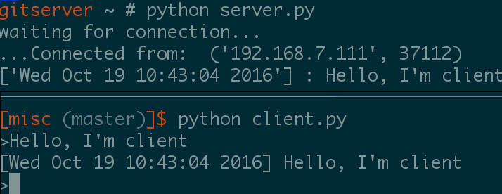
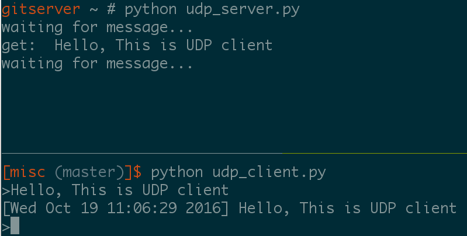
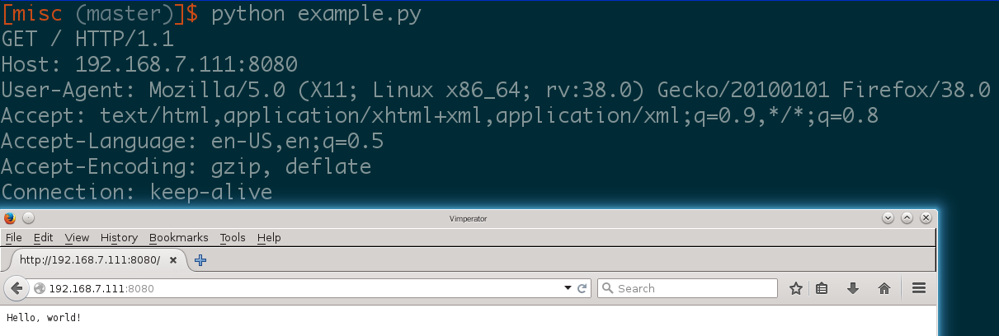

# 可变参数列表

## 使用方法1

from find_max import return_max_number

return_max_number(1)

return_max_number(1, 2)

return_max_number(1, 3, 100, 2)

## 使用方法2

python main.py

## socket

[参考文章http://blog.163.com/yi_yixinyiyi/blog/static/136286889201152814341144/](http://blog.163.com/yi_yixinyiyi/blog/static/136286889201152814341144/)

### TCP

服务器IP 192.168.7.103

客户端IP 192.168.7.111

在服务器端执行python tcp_server.py

在客户端执行python tcp_client.py

在客户端输入后可在服务器看到相应内容

### UDP

服务器IP 192.168.7.103

客户端IP 192.168.7.111

在服务器端执行python udp_server.py

在客户端执行python udp_client.py

在客户端输入后可在服务器看到相应内容

# How To Use Linux epoll with Python

[参考地址http://scotdoyle.com/python-epoll-howto.html](http://scotdoyle.com/python-epoll-howto.html)

### example1.py 是一个简单的HTTP服务器

### example2.py 对example1.py进行了改进,不断对客户端的请求
